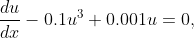

--------------------------------------------
---------------------------------------------
# odeSolu                                                                                                  
#### odeSolu is a Python package that determines power series solution of nonlinear ODE.  #
--------------
---------------

## Short usage:
An ODE is solved by the following principle method *seriesSolu* of the package *odeSolu*
```puthon
	solu = seriesSolu(ode,(dependent,independent),(iniCond1,iniCond2,....),n, (a,b))
```
Here *ode* is the input ODE, dependent and independent variables of the ODE are provided in the second argument, the initial conditions are given in the third argument, and in the fourth argument *n* represents the number of series terms. 
To test the convergence rate of the power series solution within the interval $\Omega=[a,b]$, we supply  the interval *(a,b)* in the last argument which calculate the parameter *Res*. *seriesSolu* returns two output results in a tuple: the first one is the computed series solution, a NumPy array, and the second one is an estimation of the parameter *Res* of that solution. 
Now to explain how to use the package *odeSolu* for solving an ODE, we use the following Bernoulli equation



with the initial condition u(0)=1. 
In order to get the series solution of the above equation with the help of *odeSolu* we use the Python code 
```python
1. import odeSolu as os
2. from sympy import symbols,Function,diff
3. x = symbols('x')
4. u = Function('u')
5. ode = diff(u(x),x,1)-0.1*u(x)**3+0.001*u(x)
6. solu = os.seriesSolu(ode,(x,u(x)),((u(x), 1),),300,(0,4.7))	
```
Now we will discuss each line of the code. We import the package *odeSolu* executing the command in line 1. In line 2, we import some modules from the package SymPy, which are required to write an ODE symbolically. We declare an algebraic symbol *x* and function *y* in lines 3 and 4 respectively. In line 5, we write the ODE *equ1* and assign it to the programming variable *ode*.
The package *odeSolu* calculates 300 series terms of the series solution and computes the parameter *Res* within the interval (0,4.7) using its main method *seriesSolu* in the line 6. 

We can plot the series solution in *x-u* plane using the Python code	
```python
1. import matplotlib.pyplot as plt
2. import numpy as np
3. import numpy.polynomial.polynomial as nppoly
4. x = np.linspace(0,4.7,300)
5. u = nppoly.polyval(x,solu[0])
6. plt.xlabel('x')
7. plt.ylabel('u')		
8. plt.plot(x,u,'r')
9. plt.show()
```
To plot the series solution, we have used the plotting library **matplotlib**. In line 5, the module *numpy.polynomial.polynomial* estimates the values of the series solution *solu[0]* at every point of the sequence *x* created in line 4.

 
## External packages: 
odeSolu version 1.0.5 uses the following external packages:
 1. NumPy>=1.14.5
 2. SymPy>=1.0.0
 3. SciPy>=1.0.0
 4. Cython 
 5. matplotlib (for plottings)
 6. 
## Installation:

 **odeSolu only supports Python >= 3.8**

To install odeSolu from a local copy of the project open a terminal
in this directory and type: 
```python
	python setup.py build_ext install

```
## Examples and Testings:
The "odeSolu-source/examples" folder contains some examples from which we can know the usage of the odeSolu package to solve an ODE. This folder contains two examples, example1.py, example2.py and examplePlotsInPaper.py. One can test the package using these example files by running the commands:

	python example1.py
	python example2.py
    python examplePlotsInPaper.py

To run the example1.py we need the packages odeSolu and SymPy. example2.py shows how to plot output results from odeSolu, 
    and so to run this Python file, we also require the plotting library matplotlib. examplePlotsInPaper.py contains all the examples given in the papers and to run this Python file we need matplotlib. The output results obtained from these three example Python files are also provided in this folder.


## Brief Description of all files:

   1. In "odeSolu-source" folder

    README.txt          : This file.
    LICENSE.txt         : License file.
    setup.py            : odeSolu Python installation script.

   2. In "odeSolu-source/examples" folder

    example1.py            : Some examples to solve nonlinear ODE using odeSolu (without plottings).
    example2.py            : Some examples to solve nonlinear ODE using odeSolu (with plottings and convergence tests).
    examplePlotsInPaper.py : Some examples given in the paper to solve nonlinear ODE using odeSolu (with plottings).

    Besides these three example files, there present some other 22 files in this folder. These files show the output results produced from
    the example files.
    
   3. In "odeSolu-source/odeSolu" folder

    __init__.py         : Initialize seriesSolu module. 
    seriesSolu.py       : Implementation of the module seriesSolu. It calculates the series solution and the global squared 
                          residual error (for convergence test) using adomianMat module.
    adomianMat.pyx      : Implementation of the module adomianMat. This Cython source code finds Adomian polynomials.
